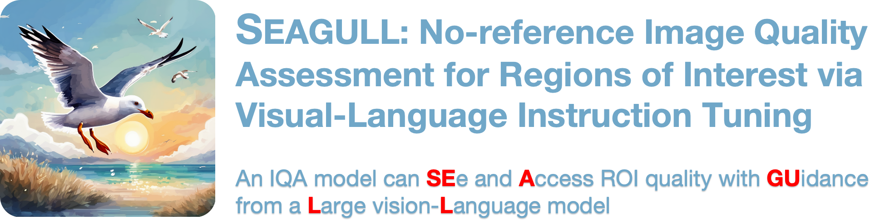

  

  <div style="display: flex; justify-content: center; gap: 10px; flex-wrap: wrap; width: 100%;">
    <a href="https://huggingface.co/spaces/Zevin2023/SEAGULL"></a>
    <a href="https://arxiv.org/abs/2411.10161"></a>
    <a href="https://huggingface.co/datasets/Zevin2023/SEAGULL-100w"></a>
    <a href="https://hits.seeyoufarm.com"></a>
    <a href='https://github.com/chencn2020/Seagull/stargazers'></a>
  </div>

:rocket:  :rocket: :rocket: **News:**
- To be updated...
- ✅ **Nov. 25, 2024**: We make SEAGULL-100w publicly available at [Hugging Face](https://huggingface.co/datasets/Zevin2023/SEAGULL-100w) and [Baidu Network](https://pan.baidu.com/s/1PY_EqdwY1FsCVfNpEXrlHA?pwd=i7h1). More details can be found at [Hugging Face](https://huggingface.co/datasets/Zevin2023/SEAGULL-100w).
- ✅ **Nov. 12, 2024**: We create this repository.


## TODO List 📝
- [x] Release the SEAGULL-100w dataset.
- [] Release the online demo.
- [] Release the checkpoints and inference codes.
- [] Release the training codes.
- [] Release the SEAGULL-3k dataset.

## Contents 📌
1. [Introduction 👀](#Introduction)
2. [Try Our Demo 🕹️](#Try-Our-Demo)
3. [Demonstrate 🎥](#Demonstrate)
4. [Acknowledgement 💌](#Acknowledgement)

## Introduction 👀
<div id="Introduction"></div>

> Existing Image Quality Assessment (IQA) methods achieve remarkable success in analyzing quality for overall image, but few works explore quality analysis for Regions of Interest (ROIs). The quality analysis of ROIs can provide fine-grained guidance for image quality improvement and is crucial for scenarios focusing on region-level quality. This paper proposes a novel network, SEAGULL, which can SEe and Assess ROIs quality with GUidance from a Large vision-Language model. SEAGULL incorporates a vision-language model (VLM), masks generated by Segment Anything Model (SAM) to specify ROIs, and a meticulously designed Mask-based Feature Extractor (MFE) to extract global and local tokens for specified ROIs, enabling accurate fine-grained IQA for ROIs. Moreover, this paper constructs two ROI-based IQA datasets, SEAGULL-100w and SEAGULL-3k, for training and evaluating ROI-based IQA. SEAGULL-100w comprises about 100w synthetic distortion images with 33 million ROIs for pre-training to improve the model's ability of regional quality perception, and SEAGULL-3k contains about 3k authentic distortion ROIs to enhance the model's ability to perceive real world distortions. After pre-training on SEAGULL-100w and fine-tuning on SEAGULL-3k, SEAGULL shows remarkable performance on fine-grained ROI quality assessment.


## Try Our Demo 🕹️
<div id="Try-Our-Demo"></div>

### Online demo
Click 👇 to try our demo.

<a href="https://huggingface.co/spaces/Zevin2023/SEAGULL"></a>

### Offline demo

💻 **requirments:** For this demo, it needs about `17GB` GPU memory for SEAGULL(15GB) and SAM(2GB).
1. Create the environment
```
conda create -n seagull python=3.10
conda activate seagull
pip install -e .
```

2. Install [Gradio Extention](https://github.com/chencn2020/gradio-bbox) for drawing boxes on images.

3. Install Segment Anything Model.
```
pip install git+https://github.com/facebookresearch/segment-anything.git
```

And download the checkpoint and put it into the ```checkpoints```
- [ViT-B SAM model](https://dl.fbaipublicfiles.com/segment_anything/sam_vit_b_01ec64.pth)


4. Run demo on your device.
```
sh scripts/run_demo.sh 
```
> [!TIP]
> If huggingface is not accessible for you, try the following command.

```
HF_ENDPOINT=https://hf-mirror.com sh scripts/run_demo.sh 
```

5. You can also download all the checkpoints:

- [SEAGULL-7b](https://huggingface.co/Zevin2023/SEAGULL-7B) 
- [CLIP-convnext](https://huggingface.co/laion/CLIP-convnext_large_d_320.laion2B-s29B-b131K-ft-soup/blob/main/open_clip_pytorch_model.bin)

Remember to change the ```mm_vision_tower``` in ```config.json``` into corresponding path.

The path structure should be:
```
├── checkpoints
    ├── Osprey_7b
    ├── sam_vit_b_01ec64.pth 
    └── open_clip_pytorch_model.bin
```

## Demonstrate 🎥
<div id="Demonstrate"></div>


## Acknowledgement 💌
<div id="Acknowledgement"></div>
- [Osprey](https://github.com/CircleRadon/Osprey) and [LLaVA-v1.5](https://github.com/haotian-liu/LLaVA): We build this repostory based on them.
- [RAISE](http://loki.disi.unitn.it/RAISE/): The Dist. images in SEAGULL-100w are constructed based on this dataset.
- [SAM](https://segment-anything.com/) and [SEEM](https://github.com/UX-Decoder/Segment-Everything-Everywhere-All-At-Once): The mask-based ROIs are generated using these two awesome works. And SAM are used to get the segmentation result in the demo.
- [TOPIQ](https://github.com/chaofengc/IQA-PyTorch): The quality scores and importance scores for ROIs are generated using this great FR-IQA.


## Stars ⭐️

<a href="https://star-history.com/#chencn2020/Seagull&Date">
 <picture>
   <source media="(prefers-color-scheme: dark)" srcset="https://api.star-history.com/svg?repos=chencn2020/Seagull&type=Date&theme=dark" />
   <source media="(prefers-color-scheme: light)" srcset="https://api.star-history.com/svg?repos=chencn2020/Seagull&type=Date" />
   
 </picture>
</a>

## Citation 🖊️
If our work is useful to your research, we will be grateful for you to cite our paper:
```
@misc{chen2024seagull,
      title={SEAGULL: No-reference Image Quality Assessment for Regions of Interest via Vision-Language Instruction Tuning}, 
      author={Zewen Chen and Juan Wang and Wen Wang and Sunhan Xu and Hang Xiong and Yun Zeng and Jian Guo and Shuxun Wang and Chunfeng Yuan and Bing Li and Weiming Hu},
      year={2024},
      eprint={2411.10161},
      archivePrefix={arXiv},
      primaryClass={cs.CV},
      url={https://arxiv.org/abs/2411.10161}, 
}
```